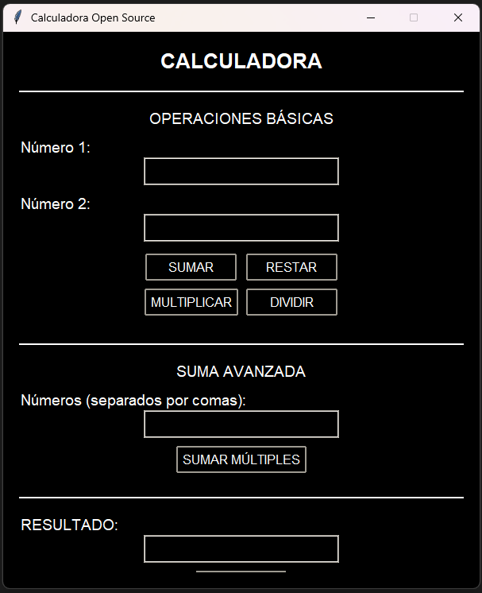

# 🧮 Calculadora Open Source


[](https://www.hybridge.education)


## Resumen
Proyecto **Calculadora Open Source** desarrollado para la clase de **Programación Avanzada** en la carrera de **Ingeniería en Inteligencia Artificial** en **Hybridge Education.**


## 📋 Características

- **Interfaz gráfica**
- **Operaciones básicas**: suma, resta, multiplicación y división
- **Suma avanzada**: permite sumar N cantidad de números
- **Arquitectura modular**: cada operación en su propio módulo
- **Manejo de errores**: validación de entradas y errores matemáticos

## 🚀 Instalación y Ejecución

### Requisitos Previos

- Python 3.6 o superior
- Tkinter (incluido por defecto en Python)

### Instalación

1. **Clona el repositorio**:
```bash
git clone https://github.com/tu-usuario/calculadora-open-source.git
cd calculadora-open-source
```

2. **Verifica que tienes Python instalado**:
```bash
python --version
```

### Ejecución

**Ejecutar la calculadora con interfaz gráfica**:
```bash
python main.py
```

**Ejecutar módulos individuales para pruebas**:
```bash
python sumar.py
python resta.py
python multiplicacion.py
python dividir.py
python suma_avanzada.py
```

## 📁 Estructura del Proyecto

```
calculadora-open-source/
├── main.py                 # Archivo principal con GUI
├── sumar.py                # Módulo de suma
├── resta.py                # Módulo de resta
├── multiplicacion.py       # Módulo de multiplicación
├── dividir.py              # Módulo de división
├── suma_avanzada.py        # Módulo de suma avanzada
├── README.md               # Este archivo
└── LICENSE                 # Licencia del proyecto
```

## 🎮 Uso de la Calculadora

### Operaciones Básicas

1. **Suma**: Ingresa dos números y presiona "SUMAR"
2. **Resta**: Ingresa dos números y presiona "RESTAR"
3. **Multiplicación**: Ingresa dos números y presiona "MULTIPLICAR"
4. **División**: Ingresa dos números y presiona "DIVIDIR"

### Suma Avanzada

1. Ingresa números separados por comas (ej: 1, 2, 3, 4, 5)
2. Presiona "SUMAR MÚLTIPLES"
3. El resultado aparecerá en el campo de resultado

### Funciones Adicionales

- **Limpiar**: Borra todos los campos de entrada y resultado
- **Validación**: La calculadora valida automáticamente las entradas
- **Manejo de errores**: Muestra mensajes de error claros

## 🧪 Pruebas

Cada módulo incluye pruebas unitarias que se ejecutan al correr el archivo individualmente:

```bash
python sumar.py          # Ejecuta pruebas de suma
python resta.py          # Ejecuta pruebas de resta
python multiplicacion.py # Ejecuta pruebas de multiplicación
python dividir.py        # Ejecuta pruebas de división
python suma_avanzada.py  # Ejecuta pruebas de suma avanzada
```

## 🔧 Funcionalidades Técnicas

### Validación de Entradas
- Verificación de tipos de datos
- Prevención de división por cero
- Manejo de números negativos y decimales

### Arquitectura Modular
- Cada operación en su propio módulo
- Funciones reutilizables
- Código limpio y mantenible

### Interfaz de Usuario
- Diseño responsive
- Colores contrastantes (negro con blanco)
- Mensajes de error informativos

## 📜 Licencia MIT
Copyright © 2024 Jesús Vásquez - Hybridge Education

Este proyecto es material académico desarrollado como parte del programa educativo de Hybridge Education.
